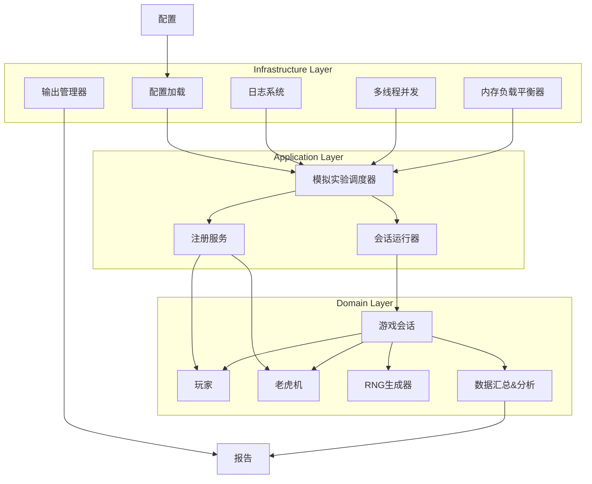

# 老虎机模拟系统 (Slot Machine Simulator)

一个用于模拟老虎机游戏行为和玩家偏好的高度可配置系统。该系统采用领域驱动设计(DDD)架构，实现了高度模块化和可扩展的代码结构。

## 功能特点

- 支持多种老虎机类型和配置
- 模拟不同类型玩家的行为
- 批处理和并发执行能力
- 灵活的配置系统
- 全面的日志记录和报告生成
- 文件选择功能，可轻松包含或排除特定配置

## 架构概览



## 目录结构

```
项目根目录/
├── docs/                          # 文档目录
├── logs/                          # 日志输出目录
├── reports/                       # 分析报告目录
├── results/                       # 模拟结果输出目录
├── src/                           # 源代码根目录
│   ├── application/               # 应用层 - 协调领域对象和基础设施
│   │   ├── analysis/              # 分析模块 - 处理模拟结果
│   │   │   ├── preference_analyzer.py   # 玩家偏好分析器
│   │   │   ├── report_generator.py      # 报告生成器
│   │   │   └── session_analyzer.py      # 会话分析器
│   │   ├── config/                # 配置文件目录
│   │   │   ├── machines/          # 老虎机配置
│   │   │   │   ├── cus_machine_1.yaml   # 自定义机器配置1
│   │   │   │   ├── cus_machine_2.yaml   # 自定义机器配置2
│   │   │   │   ├── cus_machine_3.yaml   # 自定义机器配置3
│   │   │   │   ├── default_machine.json # 默认机器配置(JSON)
│   │   │   │   └── default_machine.yaml # 默认机器配置(YAML)
│   │   │   ├── players/           # 玩家配置
│   │   │   │   ├── rand_player2.yaml    # 随机玩家配置2
│   │   │   │   └── random_player.yaml   # 随机玩家配置1
│   │   │   └── simulation/        # 模拟配置
│   │   │       └── default_simulation.yaml  # 默认模拟配置
│   │   ├── registry/              # 注册表模块 - 管理实体实例
│   │   │   ├── machine_registry.py      # 机器注册表
│   │   │   ├── player_registry.py       # 玩家注册表
│   │   │   └── registry_service.py      # 注册服务 - 统一接口
│   │   └── simulation/            # 模拟模块 - 核心模拟功能
│   │       ├── coordinator.py           # 模拟协调器 - 协调整个模拟过程
│   │       └── session_runner.py        # 会话运行器 - 执行单个游戏会话
│   ├── domain/                    # 领域层 - 核心业务逻辑
│   │   ├── events/                # 事件系统 - 领域事件处理
│   │   │   ├── event_dispatcher.py      # 事件调度器
│   │   │   ├── event_types.py           # 事件类型定义
│   │   │   ├── machine_events.py        # 机器相关事件
│   │   │   ├── player_events.py         # 玩家相关事件
│   │   │   └── session_events.py        # 会话相关事件
│   │   ├── machine/               # 机器领域 - 老虎机相关逻辑
│   │   │   ├── entities/               # 机器实体
│   │   │   │   ├── reel.py              # 轮盘实体
│   │   │   │   └── slot_machine.py      # 老虎机实体
│   │   │   ├── factories/             # 机器工厂
│   │   │   │   └── machine_factory.py   # 机器创建工厂
│   │   │   └── services/              # 机器服务
│   │   │       ├── rng_service.py       # 随机数生成服务
│   │   │       └── win_evaluation.py    # 赢利评估服务
│   │   ├── player/                # 玩家领域 - 玩家相关逻辑
│   │   │   ├── entities/               # 玩家实体
│   │   │   │   ├── decision_engine.py   # 决策引擎基类
│   │   │   │   └── player.py            # 玩家实体
│   │   │   ├── factories/             # 玩家工厂
│   │   │   │   ├── decision_engine_factory.py  # 决策引擎工厂
│   │   │   │   └── player_factory.py    # 玩家工厂
│   │   │   ├── models/                # 玩家行为模型
│   │   │   │   ├── random/             # 随机模型
│   │   │   │   │   ├── entities/         # 随机模型实体
│   │   │   │   │   │   └── random_decision_engine.py  # 随机决策引擎
│   │   │   │   │   └── services/         # 随机模型服务
│   │   │   │   │       └── random_player_model.py     # 随机玩家模型
│   │   │   │   └── v1/                 # v1模型（预留）
│   │   │   │       └── README.md         # v1模型说明
│   │   │   └── services/              # 玩家服务
│   │   │       └── model_interface.py   # 模型接口定义
│   │   └── session/               # 会话领域 - 游戏会话相关逻辑
│   │       ├── entities/               # 会话实体
│   │       │   ├── gaming_session.py    # 游戏会话实体
│   │       │   └── spin_result.py       # 旋转结果实体
│   │       ├── factories/             # 会话工厂
│   │       │   └── session_factory.py   # 会话创建工厂
│   │       └── services/              # 会话服务
│   │           └── session_manager.py   # 会话管理服务
│   ├── infrastructure/            # 基础设施层 - 技术服务支持
│   │   ├── concurrency/           # 并发处理
│   │   │   ├── process_pool.py          # 进程池实现
│   │   │   ├── task_executor.py         # 任务执行器
│   │   │   └── thread_pool.py           # 线程池实现
│   │   ├── config/                # 配置管理
│   │   │   ├── loaders/                # 配置加载器
│   │   │   │   ├── json_loader.py       # JSON配置加载器
│   │   │   │   └── yaml_loader.py       # YAML配置加载器
│   │   │   ├── schemas/               # 配置模式
│   │   │   │   ├── machine_schema.json  # 机器配置模式
│   │   │   │   ├── player_schema.json   # 玩家配置模式
│   │   │   │   └── simulation_schema.json  # 模拟配置模式
│   │   │   └── validators/            # 配置验证器
│   │   │       └── schema_validator.py  # 模式验证器
│   │   ├── logging/               # 日志处理
│   │   │   └── log_manager.py           # 日志管理器
│   │   ├── output/                # 输出管理
│   │   │   └── output_manager.py        # 输出管理器
│   │   └── rng/                   # 随机数生成
│   │       ├── rng_provider.py          # RNG提供器
│   │       └── strategies/             # RNG策略
│   │           ├── mersenne_rng.py      # Mersenne Twister RNG
│   │           ├── numpy_rng.py         # NumPy RNG
│   │           └── rng_strategy.py      # RNG策略接口
│   ├── interfaces/                # 接口层 - 用户界面
│   │   └── cli/                   # 命令行接口
│   │       ├── commands/               # CLI命令
│   │       │   ├── analyze_results.py   # 分析结果命令
│   │       │   └── run_simulation.py    # 运行模拟命令
│   │       └── main.py                 # CLI入口
│   └── main.py                    # 主程序入口
└── tests/                         # 测试目录
```


### 展示方法
tree -I '__pycache__|__init__.py' --prune -L 1 -a -d; tree src -I '__pycache__|__init__.py' --prune -a

## 安装要求

- Python 3.8 或以上
- 依赖包：
  - PyYAML
  - jsonschema
  - numpy (可选，用于高级RNG)

## 快速开始

1. 克隆仓库:
   ```bash
   git clone <repository_url>
   cd <repository_name>
   ```

2. 安装依赖:
   ```bash
   pip install -r requirements.txt
   ```

3. 运行基础模拟:
   ```bash
   python src/main.py
   ```

4. 使用自定义配置:
   ```bash
   python src/main.py -c path/to/your/config.yaml
   ```

## 配置系统

### 主配置文件 (simulation.yaml)

主配置文件包含以下部分：

```yaml
# 文件配置
file_configs:
  machines:
    dir: "src/application/config/machines"
    selection:
      mode: "all"  # 可选: "all", "include", "exclude"
      files:  # 要包含或排除的文件列表
        - "machine_001.yaml"
        - "machine_002.yaml"
  players:
    dir: "src/application/config/players"
    selection:
      mode: "all"  # 可选: "all", "include", "exclude"
      files:
        - "player_type_a.yaml"
        - "player_type_b.yaml"

# 模拟参数
initial_balance: 5000.0
sessions_per_pair: 10
batch_size: 100
use_concurrency: true
max_spins: 10000
max_sim_duration: 300
max_player_duration: 7200

# 输出配置
output:
  directories:
    base_dir: "results"
  session_recording:
    enabled: true
  reports:
    generate_reports: true

# 日志配置
logging:
  level: "INFO"
  console: true
  console_level: "INFO"
  file:
    enabled: true
    path: "logs/simulator.log"
  loggers:
    domain: 
      level: "WARNING"
    application:
      level: "INFO"
```

### 文件选择配置

您可以使用文件选择功能来控制哪些机器和玩家配置会被加载:

- `mode: "all"` - 加载目录中的所有配置文件
- `mode: "include"` - 只加载列在 `files` 列表中的文件
- `mode: "exclude"` - 加载除了列在 `files` 列表中的所有文件

## 命令行参数

```
usage: main.py [-h] [-c CONFIG] [-v] [--no-concurrency] [--log-mode {all,app,domain,none}]

Slot Machine Simulator

optional arguments:
  -h, --help            显示帮助信息并退出
  -c CONFIG, --config CONFIG
                        模拟配置文件路径
  -v, --verbose         启用详细输出
  --no-concurrency      禁用并发执行
  --log-mode {all,app,domain,none}
                        选择日志模式: 'all'=详细, 'app'=只显示应用层, 'domain'=只显示领域层, 'none'=最小化
```

## 日志控制

您可以使用 `--log-mode` 参数快速控制日志输出：

```bash
# 详细日志，显示所有调试信息
python src/main.py --log-mode all

# 只显示应用层日志
python src/main.py --log-mode app

# 只显示领域层日志
python src/main.py --log-mode domain

# 最小化日志（只显示警告和错误）
python src/main.py --log-mode none
```

您也可以在配置文件中详细控制各个日志记录器：

```yaml
logging:
  level: "INFO"  # 全局日志级别
  loggers:
    domain: 
      level: "WARNING"  # 领域层日志级别
    domain.machine:
      level: "INFO"  # 机器领域模型日志级别
    application:
      level: "DEBUG"  # 应用层日志级别
```

## 运行测试

运行完整模拟测试:

```bash
python tests/test_full_simulation.py
```

## 常见问题解决

### 导入错误

如果遇到 `ModuleNotFoundError: No module named 'src'` 等导入错误，可能是 Python 路径问题。确保您从正确的目录运行脚本，或尝试将根目录添加到 Python 路径：

```python
import sys
import os
sys.path.insert(0, os.path.abspath(os.path.dirname(os.path.dirname(__file__))))
```

### 日志问题

如果日志配置没有按预期工作，尝试使用 `--log-mode` 参数：

```bash
python src/main.py --log-mode all  # 查看所有日志
```

或直接使用 `-v` 参数启用详细输出:

```bash
python src/main.py -v
```

## 扩展系统

### 添加新的老虎机类型

1. 在 `src/application/config/machines/` 目录下创建一个新的YAML配置文件
2. 配置文件应符合预定义的模式
3. 重启模拟器，新配置将被自动加载

### 添加新的玩家类型

1. 在 `src/application/config/players/` 目录下创建一个新的YAML配置文件
2. 配置文件应符合预定义的模式
3. 重启模拟器，新配置将被自动加载
